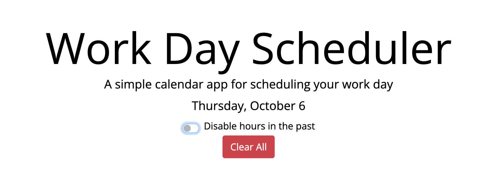

# Work Day Scheduler

## Description

This repository contains a workday scheduler. It uses bootstrap grid classes to create clean layout, and jquery to programmatically assign classes to format the hours according to whether they are past present or future (at the time of page load currently. May incorporate a setInterval to refresh every hour on the hour(setTimeout until the next hour)).

This repository utilizes
* HTML
* CSS
* JavaScript
* Bootstrap
* jQuery
* dayjs
* fontawesome

[Deployed Site](https://joedjensen.github.io/work-day-scheduler/)

## Installation 

N/A

## Usage 

Enter any events you have to schedule for the day in the appropriate hour. Save the events for each hour block by pressing the save button for that hour. These events will now persist when reloading the page.



In addition we have the ability to disable hours that are in the past (see how below!) and reset the local storage.

## Code Snippets

The most interesting functionality is the conditional formatting/functionality. Below is our treatment of elements in the past. First we add the class past to format the text area. Then, if the toggle button is checked, we disable the text area, the button, and add a class of disabled to the button.

```Javascript
if (i + 9 < currentHour) {
    entryBlockEl.addClass("past")
    // if the toggle is checked disable textare and buttons for hours in past
    if (toggleEl.is(':checked')) {
        entryBlockEl.prop('disabled', true)
        buttonEl.prop('disabled', true)
        // class used to disable button icon animation in css
        buttonEl.addClass("disabled")
    }
} ...
```

We use the disabled class to disable the hover animation in the CSS 

```CSS
.saveBtn:not(.disabled) i:hover {
  font-size: 20px;
  transition: all .3s ease-in-out;
}
```
